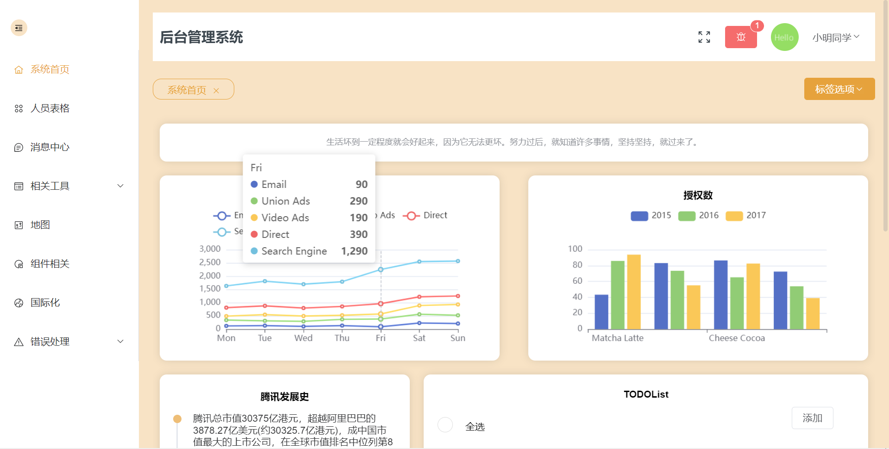
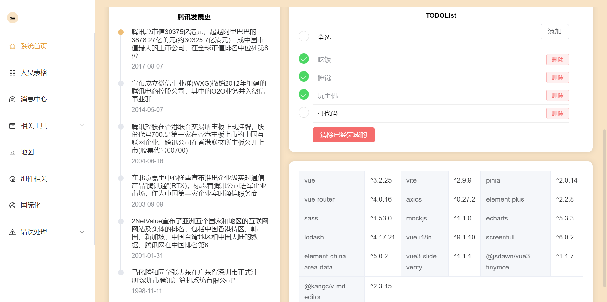
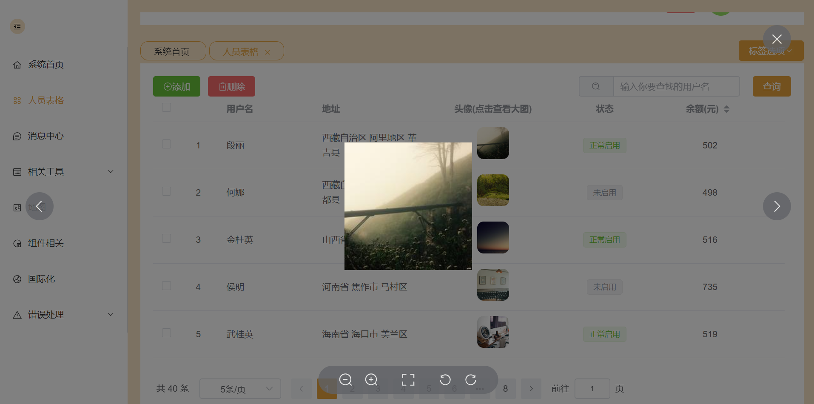
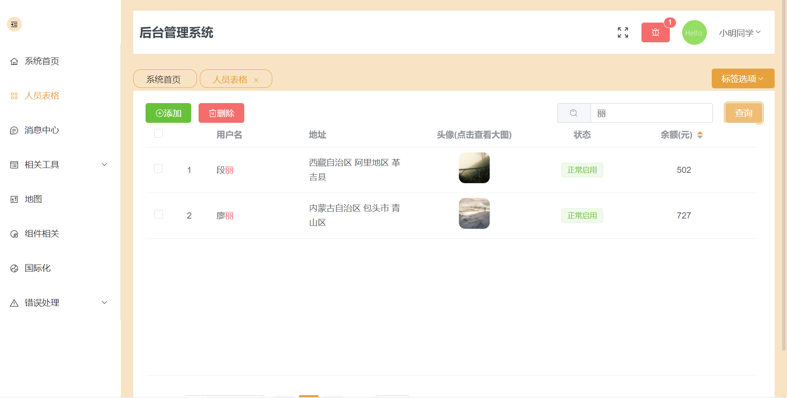
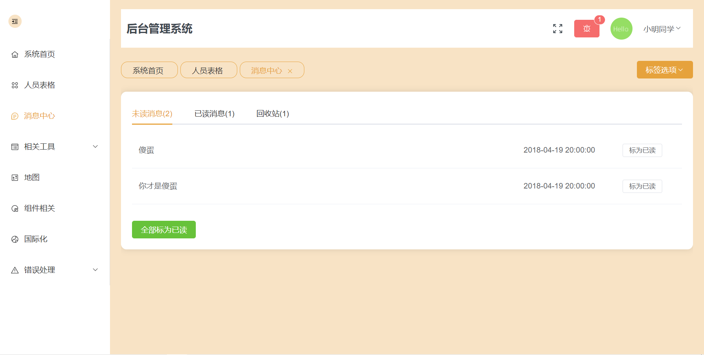
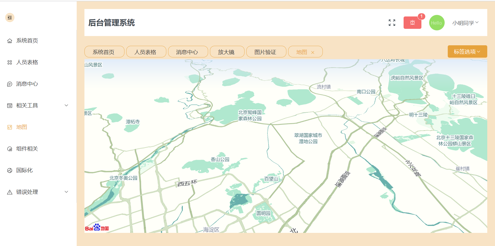
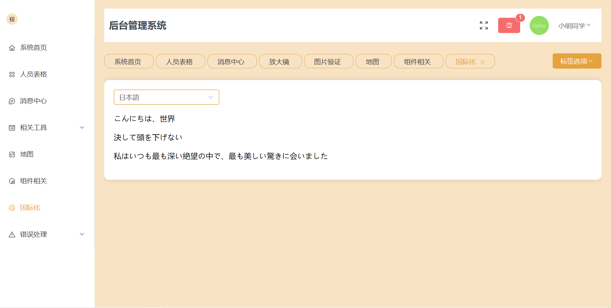

# Vue 3.2 + Vite2.0 + Pinia + Element-Plus + Mock.js🥳🥳

### 🍇🍇前言

admin-system，基于Vue 3.2 + Vite2.0 + Pinia + Vite2 + Element-Plus + Vue-router + Axios+ Scss + Mock.js开发的后台管理系统，vue3已经出了有一段时间了，一直没来得及去学😭😭，vue3和vite和Pinia都是第一次接触，学的不是很精，做这个项目纯粹是为了学习，肯定有很多不完善的地方，要是有什么bug希望大家可以多多指正。


### 🍋🍋项目功能

* Vue3.2开发，单文件组件<script setup>，变化还真的挺大的😭😭

* 采用vite代替vue-cli进行项目开发，速度确实很快😍，具体的我还在摸索
* 使用Pinia🍍🍍代替Vuex，轻量、简单，真香😍
* 组件库采用 Element-Plus ，修改了默认主题色蓝色为橙色，整个系统都是这种浅色的风格🤣🤣
* 图标库采用没有采用element plus的图标，使用了字节的iconpark，基本可以满足需要，之前都是用的iconfont但是做项目的时候在维护😭😭
* 由于我不会后端😰，因此项目采用**mock.js**模拟生成后端数据进行表格增删改查，利用**axios**请求数据
* 采用scss预处理器
* 首页做了一个TODOLIST，简简单单，因为不知道要放啥了🤣
* 常见的表格部分，采用mockjs生成的随机数据，支持分页，搜索，修改，删除，新增🤣
* 消息界面已读，未读，回收站转化
* @kangc/v-md-editor实现markdown编辑器，vue3-tinymce实现富文本编辑器，超级好用感谢感谢
* 封装echarts实现图表，采用到了lodash的debounce自适应防抖
* 采用vue-router进行路由跳转，emmm vue2和vue3的写法还有些区别😰
* 百度地图api实现地图（这里需要自己申请获取秘钥，index.html里面key=改成自己的就好啦），i18n 国际化
* 随机图库Lorem Picsum，感谢感谢
* 404页面使用到了codepen上一个比较有趣的gif动画，有标注版权信息😁
* emmm还有一些小功能，screenfull实现全屏，放大镜，图片验证码采用了别人的vue3-slide-verify插件，自己太懒了hhh😆
* ............

### 🍐🍐在线预览

戳戳我：http://zhengyufang.top/


### 🍊🍊项目部分截图

**登录**


**首页1**



**首页2**




**人员表格1**



**人员表格2**



**消息中心**



**放大镜**


**地图**



**国际化**



### 🥝🥝使用

```
npm install
npm run dev
```

### 🥦🥦文件资源目录

```
|-- README.md             #readme
|-- index.html            #入口html
|-- mock                  #mock模拟后端数据
|   |-- getAvatar.js      #获得头像数据
|   |-- index.js
|   `-- personnelList.js  #获得人员表格数据
|-- package-lock.json     #依赖包包版本锁
|-- package.json          #依赖包
|-- public
|   `-- favicon.ico       #网站图标
|-- screenshots           #项目截图
|-- src
|   |-- App.vue           #页面入口文件
|   |-- assets            #静态资源，css和img
|   |-- components        #自定义组件
|   |-- composables       #组合式函数封装方法
|   |-- main.js           #项目入口文件
|   |-- mockProdServer.js #生产环境mock配置  
|   |-- router            #路由配置
|   |-- store             #状态管理pinia
|   |-- utils             #公共的工具方法
|   `-- views             #项目所有页面
`-- vite.config.js        #vite配置
```

如果对你有帮助，欢迎star